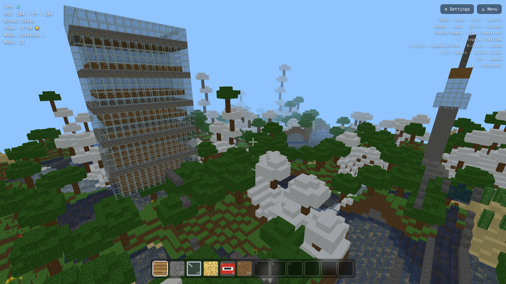
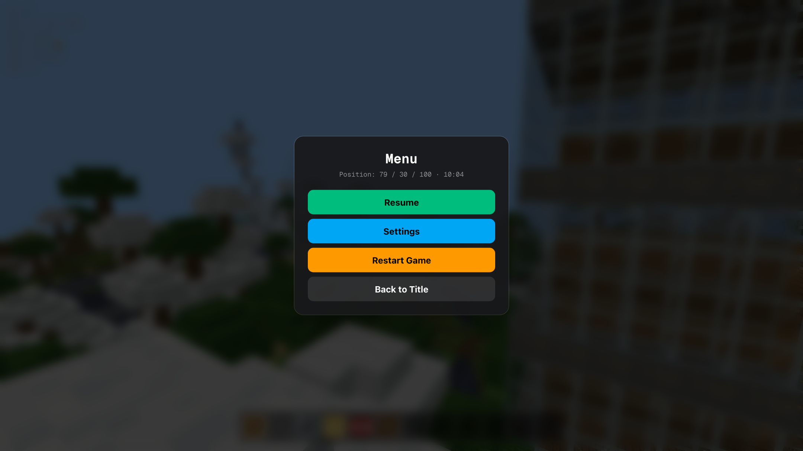

# VoxelCraft 🎮

A browser-based Minecraft-style voxel game built with **Next.js 16**, **TypeScript**, and **Three.js**. Explore, build, and survive in a procedurally generated 3D voxel world—featuring dynamic biomes, day/night cycles, hostile and passive mobs, procedural audio, particle effects, and mobile touch support—all running client-side with zero external assets.

[](https://cj-1981.github.io/voxel-craft/)
[](https://nextjs.org/)
[](https://www.typescriptlang.org/)
[](https://threejs.org/)
[](https://tailwindcss.com/)
[](LICENSE)

---



---

## 🌟 Key Features

### 🌍 World Generation & Biomes
- **Procedural 3D Terrain** — 208×48×208 voxel world generated using multi-octave Simplex noise with realistic hills, valleys, overhangs, and underground cave systems.
- **5 Distinct Biomes** — Plains, dense forests, arid deserts with cacti, snowy peaks with custom foliage, and deep oceans.
- **Underground Cave Systems & Ore Veins** — 3D noise carve-outs packed with coal, iron, gold, and diamond ore clusters.
- **30+ Hand-Crafted Block Types** — Grass, dirt, stone, wood, leaves, sand, water, glass, bricks, ores, TNT, glowstone, stairs, slabs, fences, doors, and ladders.

### ⚔️ Survival & Gameplay Mechanics
- **Dual Game Modes**:
  - **Survival Mode**: Health hearts, hunger bar, drowning/oxygen mechanics, fall damage, and hostile night mobs.
  - **Creative Mode**: Infinite flight mode (double-tap Space), invulnerability, and instant block placement/breaking.
- **Dynamic Entities & Mobs** — Passive sheep that roam grassy hills and hostile zombies that spawn under moonlight and hunt players.
- **Interactive Mechanics** — Destructive 3×3×3 TNT explosions with realistic block demolition particles, water swimming physics, and ladder climbing.
- **Inventory & Hotbar** — Full 39-slot inventory system with click-to-swap item management and a 12-slot quick access hotbar.
- **Auto-Save & Persistence** — Auto-saves world data and player coordinates to `localStorage` every 30 seconds with instant resume capability.

### 🎨 Graphics, Audio & Atmosphere
- **100% Procedural Textures** — Custom 16×16 pixel-art atlas dynamically generated via HTML5 Canvas API (no external image assets required).
- **Dynamic Day/Night Cycle** — 8-minute celestial cycle with rotating sun and moon, moving starfield, and smooth ambient/directional lighting transitions.
- **Procedural Sound Engine** — Synthesized audio effects (block breaking, footsteps, placement, TNT explosions, ambient nature) built with the Web Audio API.
- **Post-Processing & Shaders** — Optional Bloom glow, vignette shading, and FXAA anti-aliasing.
- **Cross-Platform Responsive Design** — Native desktop keyboard/mouse controls and an intuitive mobile HUD with virtual D-pad and action buttons.

---

## 🎮 Game Screenshots

### 🌄 Title & Game Mode Selection
Choose between Survival and Creative modes or continue where you left off from your auto-saved world.


---

### 🌲 Survival Gameplay & Exploration
Explore lush biomes, manage health and hunger, gather resources, and build structures with real-time lighting and HUD stats.


---

### 🌆 Creative Mode & High-Altitude Panorama
Soar freely across the skies in Creative Flight mode to admire procedurally generated biomes, cloud towers, and landmark architecture during golden sunset hours.


---

### 🌙 Night Cycle & Hostile Mobs
Survive the night as dynamic lighting shifts, stars fill the sky, and hostile zombies emerge in the darkness.


---

### 🎒 Inventory & Block Management
Manage items, quick-select tools, and organize building supplies with the 39-slot drag-and-drop inventory system.


---

### ⚙️ In-Game Settings & Visual Tuning
Fine-tune your experience with adjustable FOV, mouse sensitivity, master audio volume, and optional post-processing bloom effects.


---

### ⏸️ Pause Menu & Quick Actions
Seamlessly pause the game, modify settings, restart your session, or return to the main title screen at any point.



---

### 📱 Mobile Touch Controls & Responsive HUD
Enjoy full gameplay on smartphones and tablets with touch-friendly D-pad movement, camera drag rotation, and dedicated action buttons for jumping, mining, and placing blocks.

<p align="center">
  
</p>

---

## 🎯 Controls Guide

### Desktop Controls

| Action | Control |
|---|---|
| **Move** | <kbd>W</kbd> <kbd>A</kbd> <kbd>S</kbd> <kbd>D</kbd> |
| **Look / Aim** | Mouse Movement |
| **Jump / Ascend (Creative)** | <kbd>Space</kbd> |
| **Sprint** | <kbd>Ctrl</kbd> |
| **Crouch / Descend (Creative)** | <kbd>Shift</kbd> |
| **Break Block / Attack** | <kbd>Left Click</kbd> |
| **Place Block / Interact** | <kbd>Right Click</kbd> |
| **Select Hotbar Slot** | <kbd>1</kbd> – <kbd>9</kbd> or <kbd>Mouse Wheel</kbd> |
| **Open Inventory** | <kbd>E</kbd> |
| **Pause / Resume Menu** | <kbd>Escape</kbd> |
| **Toggle Creative / Survival** | <kbd>F</kbd> |
| **Toggle Flight (Creative)** | Double-tap <kbd>Space</kbd> |

### Mobile Touch Controls

- **Left Screen Area**: Virtual D-pad for directional movement
- **Right Screen Area**: Drag across surface to rotate camera and aim
- **Action Buttons**:
  - ⛏ **Pickaxe**: Mine block / attack entity
  - ➕ **Plus**: Place selected hotbar block
  - ⬆️ **Up Arrow**: Jump
  - 🏃 **Run**: Toggle sprint

---

## 🚀 Getting Started

### Play in Browser
The latest build is hosted live on GitHub Pages:
👉 **[https://cj-1981.github.io/voxel-craft/](https://cj-1981.github.io/voxel-craft/)**

### Local Setup & Development

Ensure you have **Node.js 18+** installed.

```bash
# 1. Clone the repository
git clone https://github.com/CJ-1981/voxel-craft.git
cd voxel-craft

# 2. Install dependencies
npm install

# 3. Start local development server
npm run dev

# 4. Open in browser
# Navigate to http://localhost:3000/voxel-craft
```

### Production Build & Export

```bash
# Build static export for deployment
npm run build

# Output will be generated in ./out
```

### Running Automated E2E Tests

```bash
# Run Playwright test suite
npm test

# Run tests in interactive UI mode
npm run test:ui

# Run tests with visible browser window
npm run test:headed
```

### Capturing Screenshots

To automatically regenerate all game screenshots in high definition:

```bash
node capture-screenshots.mjs
```

---

## 🏗️ Technical Architecture

### Tech Stack
- **Framework**: Next.js 16 (React 19, Static App Router Export)
- **Programming Language**: TypeScript 5 (Strict Mode)
- **3D Graphics Engine**: Three.js r185
- **Noise Algorithms**: Simplex Noise (`simplex-noise`)
- **Styling**: Tailwind CSS 4 + Radix UI primitives
- **Testing & Automation**: Playwright E2E Suite

### Directory Overview
```
voxel-craft/
├── docs/
│   └── screenshots/          # Game preview screenshots & assets
├── src/
│   ├── app/                  # Next.js App Router root layout & entry
│   │   ├── globals.css       # Global styles & Tailwind directives
│   │   ├── layout.tsx        # HTML document layout & metadata
│   │   └── page.tsx          # Game page entry
│   ├── components/
│   │   ├── game/             # Game UI & canvas components
│   │   │   ├── MinecraftGame.tsx # Main Three.js loop & state manager
│   │   │   └── InventoryUI.tsx   # 39-slot inventory & hotbar UI
│   │   └── ui/               # Reusable Radix UI & shadcn components
│   ├── lib/
│   │   └── game/             # Modular voxel engine subsystems
│   │       ├── blocks.ts     # Block registry, hardness, and types
│   │       ├── daynight.ts   # Celestial lighting, sun/moon/stars
│   │       ├── mobs.ts       # Entity state, pathfinding, and models
│   │       ├── particles.ts  # Particle emitter & demolition effects
│   │       ├── player.ts     # AABB voxel physics & survival stats
│   │       ├── postprocessing.ts # Three.js render passes & bloom
│   │       ├── sound.ts      # Web Audio procedural sound synthesis
│   │       ├── textures.ts   # Dynamic 16x16 Canvas texture atlas
│   │       └── world.ts      # Simplex noise terrain & chunk meshing
│   └── hooks/                # Mobile detection & browser hooks
├── tests/
│   └── e2e/                  # Playwright end-to-end test specs
├── capture-screenshots.mjs   # Automated screenshot capture script
└── next.config.ts            # Next.js static export & basePath config
```

### Key Subsystems & Optimizations

1. **Chunk Meshing & Face Culling**
   - The 208×48×208 world is partitioned into 16×16×16 voxel chunks.
   - Hidden interior voxel faces are culled before mesh compilation, reducing visible geometry down to ~40k–50k polygons for 60 FPS rendering on web and mobile.
2. **Three-Pass Rendering Pipeline**
   - **Opaque Pass**: Solid blocks (stone, dirt, wood, ores).
   - **Cutout Pass**: Alpha-tested foliage, flowers, cacti, and ladders.
   - **Translucent Pass**: Blended water surfaces and tinted glass.
3. **DDA Fast Voxel Raycasting**
   - Fast Digital Differential Analyzer (DDA) grid traversal algorithm for block selection, hit testing, and placement with 5-block reach.
4. **Storage & Serialization**
   - World block data is compactly serialized to base64 byte arrays and stored in `localStorage` alongside player state (coordinates, rotation, health, hunger, inventory).

---

## 🔧 Game Configuration

World dimensions and parameters can be easily configured in [`src/lib/game/world.ts`](src/lib/game/world.ts):

```typescript
export const WORLD_SIZE_X = 208  // World length (X)
export const WORLD_SIZE_Y = 48   // World height (Y)
export const WORLD_SIZE_Z = 208  // World width (Z)
export const WATER_LEVEL = 12    // Sea level elevation
```

---

## 🚢 Deployment Workflow

This project is configured for continuous deployment to **GitHub Pages** via GitHub Actions:

1. Any push to `main` triggers the deployment workflow.
2. Next.js statically builds and exports all HTML, JS, CSS, and procedural assets into `./out`.
3. The build is deployed to `https://cj-1981.github.io/voxel-craft/`.

---

## 📝 License

This project is licensed under the **MIT License** — feel free to use, modify, and build upon it!

---

<p align="center">
  <b>Enjoy building and exploring in VoxelCraft! ⛏️🧱</b><br>
  <sub>Created with Three.js, TypeScript, and Next.js</sub>
</p>
