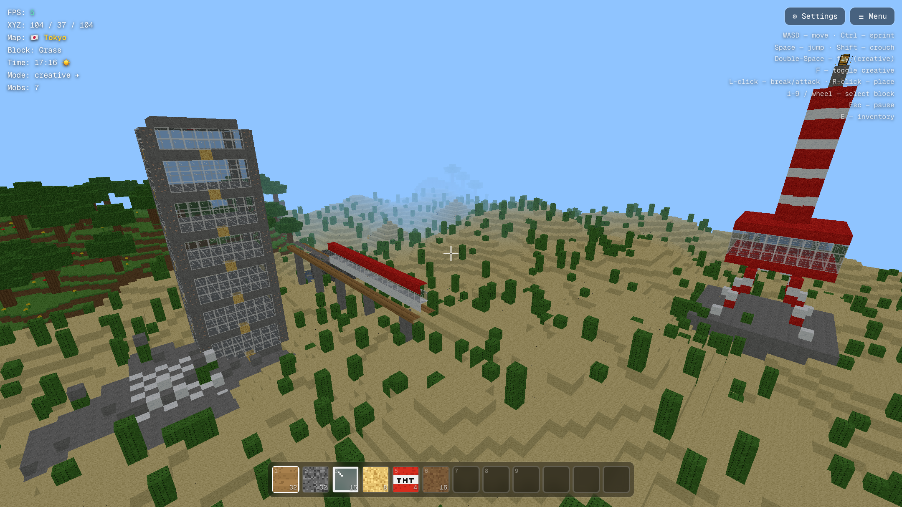
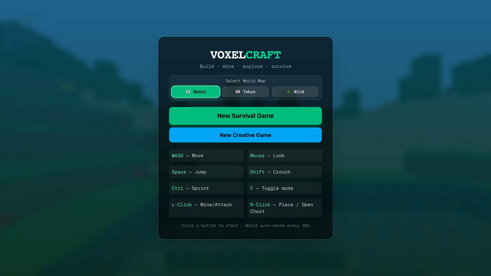
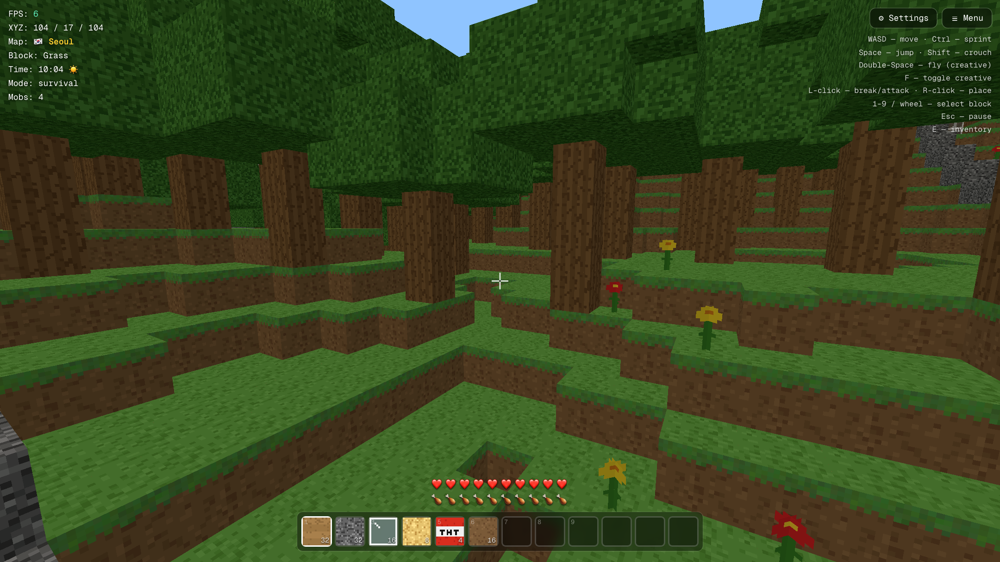
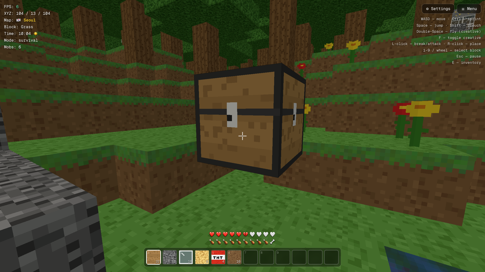
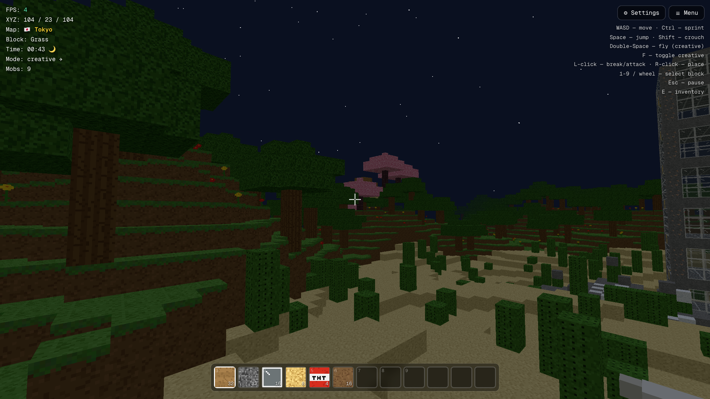
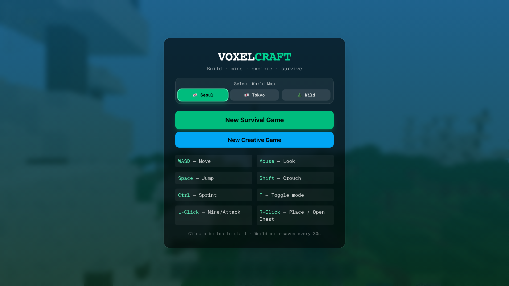
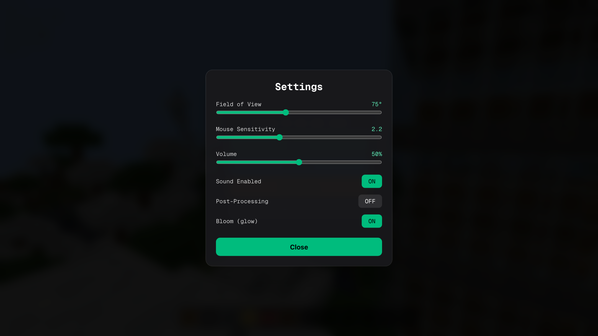
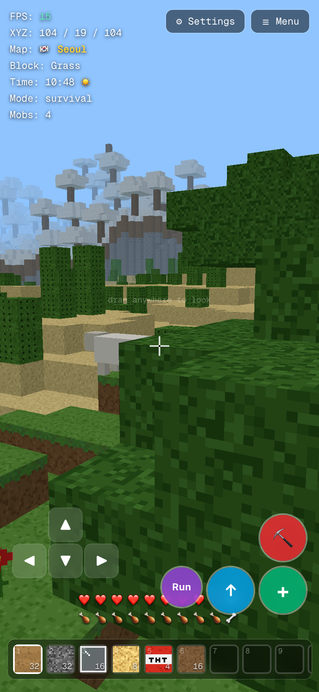

# VoxelCraft 🎮

A browser-based Minecraft-style voxel game built with **Next.js 16**, **TypeScript**, and **Three.js**. Explore, build, and survive in procedurally generated 3D voxel worlds—featuring multiple interactive city and nature maps (**Seoul Metropolis**, **Tokyo Megacity**, and **Wilderness**), naturally generated structures and dungeons, lava/water fluid physics, interactive loot chests, dynamic biomes, day/night cycles, mobs, procedural audio, and mobile touch support—all running client-side with zero external assets.

[](https://cj-1981.github.io/voxel-craft/)
[](https://nextjs.org/)
[](https://www.typescriptlang.org/)
[](https://threejs.org/)
[](https://tailwindcss.com/)
[](LICENSE)

---



---

## 🌟 Key Features

### 🗺️ Multi-World & Map Selection System
- 🇰🇷 **Seoul Metropolis** — N Seoul Tower hill, Han River bridge, Gyeongbokgung Palace gate, Gangnam glass skyscrapers, and Hanok traditional village.
- 🇯🇵 **Tokyo Megacity** — Tokyo Skytree & Tower lattice spire, Senso-ji 5-tier Pagoda & Grand Red Torii Gate, Shibuya neon glass skyscrapers with scramble crossings, Sakura Cherry Blossom Zen Gardens, and an elevated Shinkansen bullet train viaduct.
- 🌲 **Wilderness Realm** — Pure untouched procedural wilderness with subterranean dungeons, desert pyramids, deep caverns, and lava ravines.

### 🏛️ Naturally Generated Structures & Dungeons
- **Underground Cobblestone Dungeons** — Hidden 7×7 subterranean chambers with mossy cobblestone walls, central Monster Spawners, and Loot Chests.
- **Desert Sandstone Pyramids** — Stepped desert temples with secret underground vaults, TNT explosion traps, and treasure chests.
- **Subterranean Lava Lakes & Fluid Physics** — Glowing molten lava pools ($Y \le 12$) that emit light (level 15) and inflict burn damage. Contact between water and lava transforms liquids into **Obsidian** or Cobblestone!
- **Interactive 27-Slot Loot Chests** — Right-click (or tap on mobile) any chest block to open the chest looting interface with randomized rare dungeon loot (Diamonds, Gold/Iron Ore, TNT, Glowstone, Food).

### 🌍 World Generation & Biomes
- **Procedural 3D Terrain** — $208 \times 48 \times 208$ voxel world generated using multi-octave Simplex noise with realistic hills, overhangs, and 3D cave tunnels.
- **5 Distinct Biomes** — Plains, dense forests, arid deserts with cacti, snowy peaks with custom foliage, and oceans.
- **40+ Hand-Crafted Block Types** — Grass, dirt, stone, wood, cherry wood, cherry leaves, red lacquer, sandstone, obsidian, lava, water, glass, bricks, ores, TNT, glowstone, lanterns, stairs, slabs, fences, doors, chests, spawners, and ladders.

### ⚔️ Survival & Gameplay Mechanics
- **Dual Game Modes**:
  - **Survival Mode**: Health hearts, hunger bar, lava burning damage, drowning/oxygen mechanics, fall damage, and hostile night mobs.
  - **Creative Mode**: Infinite flight mode (double-tap Space), invulnerability, and instant block placement/breaking.
- **Dynamic Entities & Mobs** — Passive sheep that graze on grassy hills and hostile zombies that spawn under moonlight to hunt players.
- **Interactive Mechanics** — Destructive 3×3×3 TNT explosions with realistic block demolition particles, water swimming, and ladder climbing.
- **Inventory & Hotbar** — Full 39-slot inventory system with click-to-swap item management and a 12-slot quick access hotbar.
- **Auto-Save & Persistence** — Auto-saves world blocks, chest inventories, and player coordinates to `localStorage` every 30 seconds.

### 🎨 Graphics, Audio & Atmosphere
- **100% Procedural Pixel-Art Atlas** — Custom 48-tile pixel-art atlas dynamically generated via HTML5 Canvas API (no external images required).
- **Dynamic Day/Night Cycle** — 8-minute celestial cycle with rotating sun and moon, moving starfield, and smooth ambient lighting.
- **Procedural Sound Engine** — Synthesized audio effects (block breaking, footsteps, placement, TNT explosions, ambient nature) built with the Web Audio API.
- **Cross-Platform Responsive Design** — Native desktop keyboard/mouse controls and an intuitive mobile HUD with virtual D-pad and action buttons.

---

## 🎮 Game Screenshots

### 🌄 Title & Map World Selection
Choose between **Seoul Metropolis**, **Tokyo Megacity**, or **Wilderness**, and launch into Survival or Creative mode.



---

### 🗼 Tokyo Megacity Map (New in v1.2)
Explore Tokyo Skytree, the Senso-ji Pagoda and Torii Gate, Shibuya skyscrapers, Sakura Cherry Blossom groves, and the elevated Shinkansen bullet train railway.


---

### 🌲 Survival Gameplay & Exploration
Explore scenic hilltops and biomes with real-time health, hunger, coordinates, and active map indicators.



---

### 📦 3D Loot Chests & Storage System
Discover subterranean dungeons or place your own chests to store items and collect rare randomized loot.



---

### 🌙 Night Cycle & Hostile Mobs
Survive the night as dynamic lighting shifts, stars fill the sky, and hostile zombies emerge in the darkness.



---

### 🎒 Inventory & Item Picker
Manage items, quick-select tools, and organize building supplies with the 39-slot inventory system.



---

### ⚙️ In-Game Settings & Visual Tuning
Fine-tune your experience with adjustable FOV, mouse sensitivity, master audio volume, and optional post-processing bloom effects.



---

### 📱 Mobile Touch Controls & Responsive HUD
Enjoy full gameplay on smartphones and tablets with touch-friendly D-pad movement, camera drag rotation, and dedicated action buttons for jumping, mining, and placing/opening chests.

<p align="center">
  
</p>

---

## 🕹️ Controls Guide

### 🖥️ Desktop (Keyboard & Mouse)
| Action | Key / Input |
| :--- | :--- |
| **Move** | <kbd>W</kbd> <kbd>A</kbd> <kbd>S</kbd> <kbd>D</kbd> |
| **Look / Rotate Camera** | Mouse Movement (Pointer Lock) |
| **Jump / Swim Up** | <kbd>Space</kbd> |
| **Toggle Creative Flight** | Double-tap <kbd>Space</kbd> |
| **Crouch** | <kbd>Shift</kbd> |
| **Sprint** | <kbd>Ctrl</kbd> |
| **Mine / Attack Mob** | <kbd>Left Click</kbd> |
| **Place Block / Open Chest** | <kbd>Right Click</kbd> |
| **Select Hotbar Slot** | <kbd>1</kbd>–<kbd>9</kbd> or Mouse Scroll Wheel |
| **Open Inventory** | <kbd>E</kbd> |
| **Toggle Mode (Survival/Creative)** | <kbd>F</kbd> |
| **Pause Game / Menu** | <kbd>Escape</kbd> |

### 📱 Mobile & Touch Devices
| Action | Touch Control |
| :--- | :--- |
| **Movement** | On-screen Virtual D-Pad (bottom-left) |
| **Look / Aim** | Drag anywhere across the right half of the screen |
| **Jump** | <kbd>↑</kbd> Button |
| **Mine Block / Attack** | <kbd>⛏</kbd> Action Button |
| **Place Block / Open Chest** | <kbd>+</kbd> Action Button |
| **Sprint** | <kbd>Run</kbd> Toggle Button |
| **Creative Flight** | <kbd>✈</kbd> Button (Creative mode only) |
| **Select Block** | Tap any slot in the bottom hotbar |

---

## 🏗️ Technical Architecture

```
voxel-craft/
├── src/
│   ├── app/
│   │   ├── layout.tsx         # Root layout with SEO metadata & viewport config
│   │   └── page.tsx           # Main page rendering the full-screen game canvas
│   ├── components/
│   │   └── game/
│   │       ├── MinecraftGame.tsx # Core Three.js game loop, inputs, HUD & modals
│   │       ├── InventoryUI.tsx   # 39-slot inventory & creative block picker
│   │       └── ChestUI.tsx       # 27-slot chest looting & storage interface
│   └── lib/
│       └── game/
│           ├── blocks.ts       # 40+ block definitions, collision, transparency & light
│           ├── textures.ts     # 48-tile procedural Canvas pixel-art atlas generator
│           ├── world.ts        # Simplex noise terrain, biomes, chunk meshing & save
│           ├── structures.ts   # Dungeon, desert pyramid & lava lake generators
│           ├── player.ts       # AABB collision physics, gravity, hunger & lava damage
│           ├── mobs.ts         # Sheep & zombie models, physics, AI & combat
│           ├── daynight.ts     # Celestial day/night cycle, sun, moon & starfield
│           ├── particles.ts    # Instanced block breaking & TNT explosion particles
│           ├── sound.ts        # Web Audio API procedural sound synthesizer
│           ├── postprocessing.ts # Custom Bloom, vignette & anti-aliasing passes
│           ├── maps/
│           │   └── tokyo.ts    # Tokyo Skytree, Pagoda, Shibuya, Sakura & Shinkansen
│           └── seoul.ts        # N Seoul Tower, Han River, Gyeongbokgung & Hanok
├── docs/
│   └── screenshots/           # High-resolution gameplay captures
├── capture-screenshots.mjs    # Automated Playwright screenshot pipeline
└── package.json
```

---

## 🚀 Getting Started Locally

### Prerequisites
- **Node.js**: v18.0.0 or higher
- **npm** / **bun** / **pnpm**

### Installation
```bash
# 1. Clone the repository
git clone https://github.com/CJ-1981/voxel-craft.git
cd voxel-craft

# 2. Install dependencies
npm install

# 3. Start the development server
npm run dev
```

Open [http://localhost:3000/voxel-craft](http://localhost:3000/voxel-craft) in your browser.

### Building for Production
```bash
npm run build
```
Generates a static HTML/JS export in the `out/` directory, ready to deploy to GitHub Pages or any static CDN.

---

## 📜 License

Distributed under the **MIT License**. See `LICENSE` for more information.
